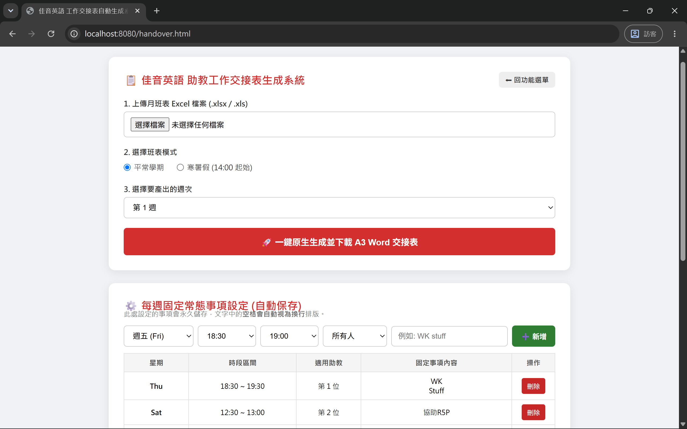
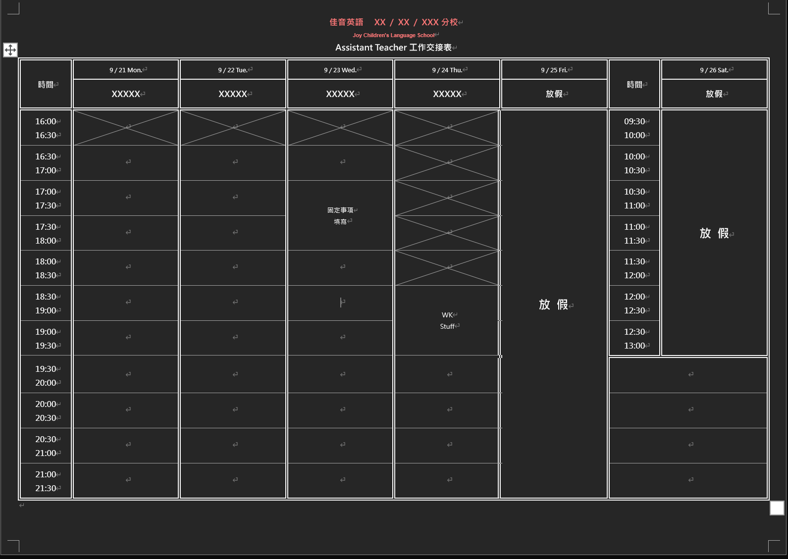
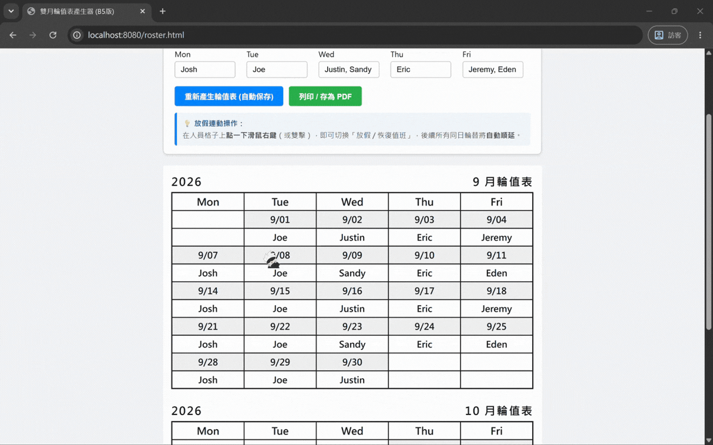

# 🏫 補習班分校行政自動化工具箱
> 專為分校行政排班設計的自動化小工具，解決手動排版耗時、複製貼上容易出錯的痛點。

---

## 📌 為什麼做這個工具？

每週排班與交接是補習班行政很花時間的工作：
1. **交接表排版麻煩**：每次都要把排班 Excel 轉抄到 Word，寒暑假跟平常學期的上班時段又不同，手動調整常造成表格跑版、跨頁，或是未上班時段打叉劃記劃錯。
2. **輪值表順延手動改到眼花**：雙月輪值只要遇到連假或請假，後面整個月的人員順序都要手動一個個往後改，非常容易漏掉。

這個專案把這兩項流程完全自動化：**上傳 Excel 就能一鍵做出不跑版的 A3 Word 交接表**，以及**按右鍵標記放假、名單就會自動往後順延的 B5 輪值表**。

---

## 📸 功能展示 (Demo)

### 1. 功能導航首頁
點開系統後會看到清楚的選單，直接點選要使用的功能：

<!-- 放在這裡：首頁 index.html 截圖 -->

---

### 2. 助教工作交接表（自動產出 A3 Word）
* **操作方式**：上傳每月的排班 Excel，選擇週次與模式（平常學期 / 寒暑假），按下一鍵生成。
* **自動處理的細節**：
  * **時段自適應**：平常學期從 16:00 開始，寒暑假自動切換為 14:00 起始，表格列高會自動縮放，保證 **100% 剛好一張 A3 印出不分頁**。
  * **防呆過濾**：自動忽略標記「(校務)」、「(教務)」、「請假」的人員，並將「兩點預備班」自動優先排入。
  * **自動打叉**：還沒到上班時間的格子，自動劃上標準對角線打叉。

<!-- 放在這裡：左邊放網頁操作畫面截圖，右邊放產出的 Word 成果 -->
| 網頁操作介面 | 實際產出的 A3 Word 表格 |
| :---: | :---: |
|  |  |

---

### 3. 雙月輪值表產生器（放假自動順延 + B5 列印）
* **操作方式**：輸入週一到週五的輪值名單與起始月份，自動排好兩個月份的表格。
* **核心亮點（自動順延）**：
  * 遇到國定假日或請假，**在格子上點一下滑鼠右鍵**切換成「放假」。
  * 系統會**自動把原本該天值班的人順延到下一次**，不用手動一筆筆修改。
  * 版面完全依照 B5 紙張規格設計，瀏覽器直接按「列印」即可完美輸出。

<!-- 放在這裡：右鍵點擊放假、後面名字自動往後跳的 GIF 動圖 -->

---

## ⚙️ 貼心設計（隨開隨用）

為了讓分校的行政同仁不需要懂任何程式設定也能直接用：
* **免安裝環境**：已將執行環境打包進資料夾，電腦沒裝過 Java 也能直接跑。
* **點兩下啟動**：點擊 `啟動系統.bat` 就會自動在背景執行並開啟瀏覽器。
* **自動記憶設定**：每週的固定常態事項、輪值人員名單，修改後都會自動存檔，下次打開不必重新輸入。

---

## 🛠 使用工具與技術

* **後端核心**：Java / Spring Boot（處理檔案上傳、資料保存與系統運行）
* **文件生成**：Apache POI（精確控制 Word 儲存格寬度、列高、格線與打叉）
* **前端介面**：HTML / CSS / JavaScript（簡單直覺的操作介面與列印排版）
